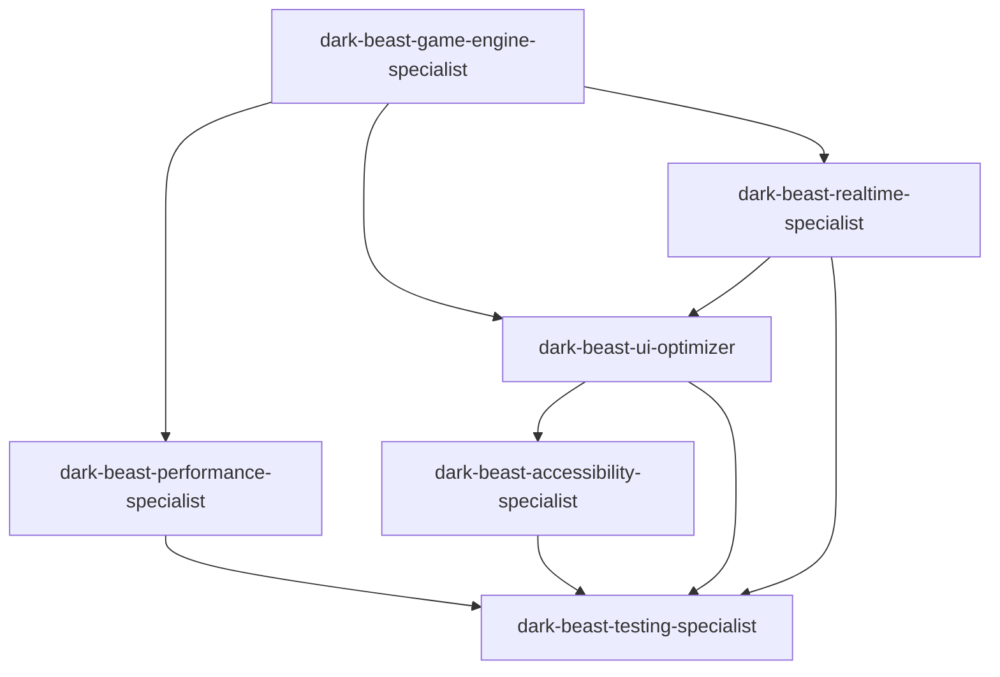

# Dark Beast Chess - Project Configuration

## Project Overview
**Dark Beast Chess** is a strategic board game implementation featuring complex eating rules and anti-stalemate mechanisms. Built with vanilla HTML5/CSS3/JavaScript using Material Design 3 principles.

## Custom AI Development Team 🤖

The following project-specific AI agents have been created to optimize development workflow:

### 🎮 Core Game Development
- **dark-beast-game-engine-specialist** (opus) - Advanced game logic, rules implementation, and algorithm optimization
- **dark-beast-ui-optimizer** (sonnet) - Material Design 3 UI optimization and responsive design
- **dark-beast-realtime-specialist** (sonnet) - WebSocket real-time communication and multiplayer systems
- **dark-beast-performance-specialist** (sonnet) - Performance optimization and monitoring
- **dark-beast-accessibility-specialist** (sonnet) - WCAG 2.1 AA compliance and inclusive design
- **dark-beast-testing-specialist** (sonnet) - Comprehensive testing and quality assurance

### 🔧 Agent Collaboration Matrix



### 🎯 Usage Examples

```bash
# Optimize game engine performance
/ai "optimize the eating rules algorithm for better performance"

# Enhance UI responsiveness
/ai "improve mobile touch interactions for piece selection"

# Real-time multiplayer optimization
/ai "optimize WebSocket connection handling for better latency"

# Test accessibility compliance
/ai "verify WCAG 2.1 AA compliance for screen readers"

# Performance optimization
/ai "reduce memory usage during long game sessions"

# Comprehensive testing
/ai "create test cases for anti-stalemate mechanism"
```

## Project Technical Stack

- **Frontend**: HTML5, CSS3 (Material Design 3), Vanilla JavaScript ES6+
- **Backend**: Node.js, Express.js, Socket.io (WebSocket real-time communication)
- **Architecture**: Object-Oriented Design, State Machine Pattern, Event-driven
- **Performance**: GPU-accelerated animations, responsive design
- **Accessibility**: WCAG 2.1 AA compliant
- **Code Size**: 3,220+ lines (Medium-High complexity)

## Development Standards

- **Code Quality**: ES6+ modern JavaScript, semantic HTML
- **Design System**: Material Design 3 with CSS custom properties
- **Performance**: <2s load time, 60fps animations, <50MB memory
- **Accessibility**: WCAG 2.1 AA compliance, keyboard navigation
- **Browser Support**: Chrome 80+, Firefox 75+, Safari 13+, Edge 80+

## Team Communication

When working with the custom AI team:
1. Use `/ai list` to see all available agents (including custom ones marked with 🏢)
2. Custom agents automatically prioritize project-specific context
3. Agents collaborate seamlessly with dependency awareness
4. Use `/ai "task description"` to auto-route to the best specialist

---

*Custom AI team enhanced by InitX on 2025-09-21*